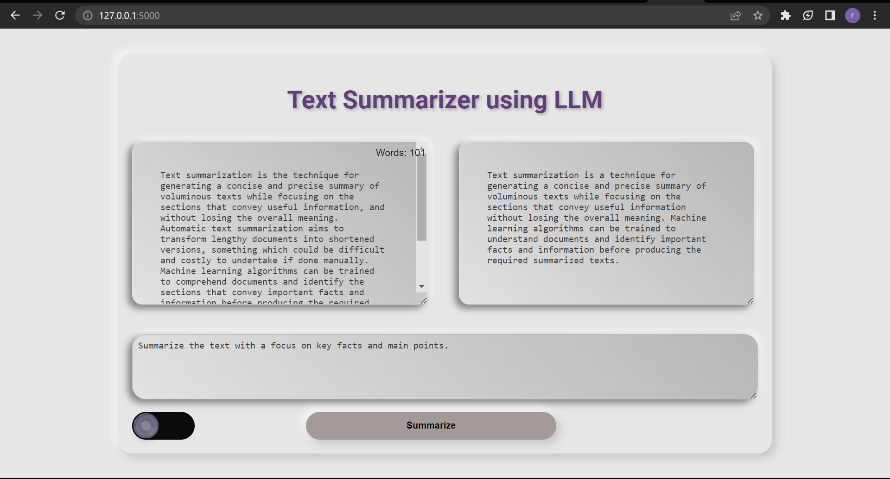

# Text Summarization Web App


## Description

The Text Summarization Web App is a user-friendly application that leverages the power of the Hugging Face "transformers" library to provide text summarization functionality. Using the T5 model checkpoint "LaMini-Flan-T5-248M," the app can generate abstractive or extractive summaries of input text along with additional instructions.

## Web Interface

Here is a screenshot of the web interface of our Text Summarization Web App:



## Features

- Text Summarization: The app utilizes the Hugging Face "transformers" library to perform text summarization using the "LaMini-Flan-T5-248M" checkpoint.
- Abstractive or Extractive Summaries: Users can choose between abstractive and extractive summarization modes, allowing them to experiment with different summarization approaches.
- Word Count Display: The app counts and displays the number of words in the input text, providing a useful reference for users.
- User-Friendly Interface: The web interface is intuitive and easy to use, enabling users to generate summaries effortlessly.

## How to Use

1. Access the live demo of the web app: [Text Summarization Web App](http://your-domain.com/)

2. Input Text: In the text input box, enter the text that you want to summarize. You can input any text, such as articles, essays, or paragraphs.

3. Instructions (Optional): Provide any specific instructions or context for the summarization process in the "Instructions" input box. These instructions will help guide the summarization process.

4. Abstractive Summarization (Optional): If you wish to use abstractive summarization, toggle the switch to the "on" position. For extractive summarization, leave the switch in the "off" position.

5. Generate Summary: Click the "Summarize" button to initiate the summarization process.

6. View Summary: The app will display the generated summary based on your input and instructions. The output will appear below the input boxes.

## Technology Stack

- Python
- Flask
- Hugging Face Transformers Library

Sure! Here's the updated section in the README to include the model download link:

## Installation

As the app uses the "LaMini-Flan-T5-248M" model checkpoint from the Hugging Face model hub, you need to download the model before running the application. Follow these steps to download the model:

1. Download the "LaMini-Flan-T5-248M" model from the Hugging Face model hub using git. Open your terminal or command prompt and run the following command:

   ```
   git clone https://huggingface.co/MBZUAI/LaMini-Flan-T5-248M
   ```

2. After downloading the model, make sure the model checkpoint folder is placed in the root directory of the application.

3. Install the required dependencies:

   ```
   pip install flask transformers
   ```

4. Run the Flask application:

   ```
   python app.py
   ```

5. Access the web app in your browser at `http://localhost:5000/`.

## Contributing

Contributions to this project are welcome! If you have ideas for improving the app or adding new features, feel free to fork the repository and submit a pull request.

## License

This project is open-source and is licensed under the MIT License.

## Contact

For any questions or inquiries, please contact:

- Name: [Rutik_Parab]
- Email: [rutikparab6@gmail.com]
